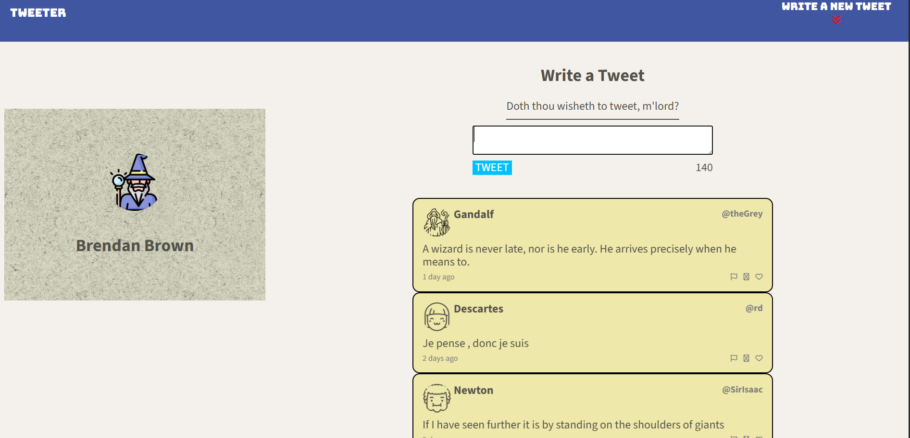
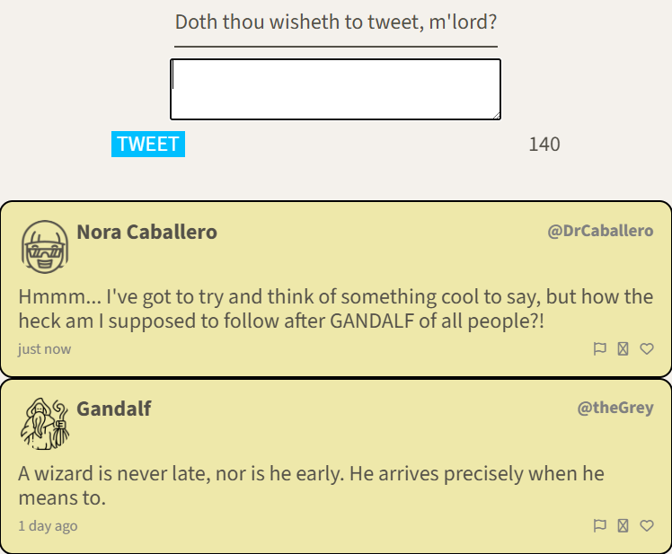
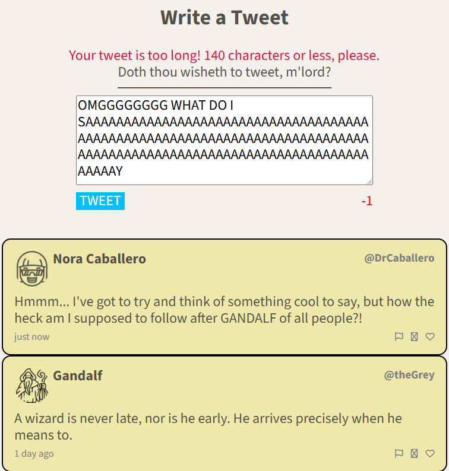

# Tweeter Project

Tweeter is a simple, single-page Twitter clone.

This version of Tweeter was built by Brendan Brown, and will serve
as a running project that he'll continue to add to and improve on.

## Getting Started

1. Clone the Repository & Install Dependencies.

- git clone https://github.com/wizbren/tweeter.git
- cd tweeter
- npm install

2. Run Project Locally.

- npm run local

3. Visit http://localhost:8080/ in your browser.

## Dependencies

- Express
- Chance
- Body-parser
- Node 5.10.x or above

### Screenshots

### NOTES

"npm run local" uses nodemon to automatically restart the server when changes are made to the code.

If you don't already have nodemon installed, run the following command:
 - npm install -g nodemon